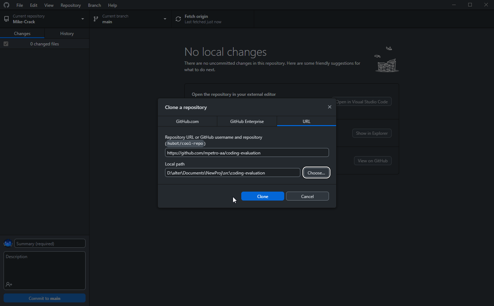

# Coding evaluation projects

<<<<<<< HEAD
#Coding evaluation
```
Your goal is to make this project functional by completing the hire() method in the Organization class. You are free to change existing code or add additonal code, with the exception of MyOrganization.java. This file must not be changed.
```


Requirements for the Coding Evaluation for Java:
1. Made sure I had java 15 or up


Then we close the repo and make sure that we can fork this git repo afterwards

=======
These projects are intended to help AA interviewers to evaluate the coding skills of job candidates. The projects are all identical in nature, but implemented in different languages.
