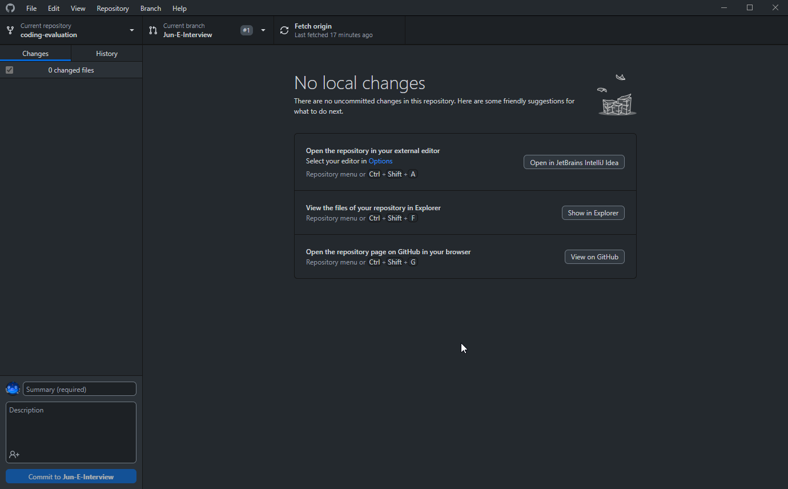

# Coding evaluation projects

These projects are intended to help AA interviewers to evaluate the coding skills of job candidates. The projects are all identical in nature, but implemented in different languages.

Requirements for the Coding Evaluation for Java:
1. Made sure I had java 15 or up

2. Use IntelliJ IDEA

3. Connect to GitHub and show link if finished
   
4. Close the repo and make sure that we can fork this git repo afterwards
